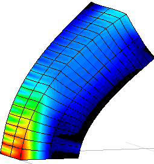

## Nonlinear finite elements for continuum mechanichs

In this repository are stored MATLAB codes that implement the nonlinear finite elements in [3D](./3D/) and [2D](./2D/) plane stress using the total lagrangian formulation.

   

## Inputs:

|Input              | Variables name| Type                                |
|-------------------|---------------|-------------------------------------|
| Young modulus     | **E**         | Float                               |
| Poisson ratio     | **nu**        | Float                               |
| Thickness         | **t**         | Float (just for 2D)                 |
| Load steps        | **steps**     | Int                                 |
| Maximum iteration | **it_max**    | Int                                 |
| Tolerance         | **tol**       | Float                               |
| Element type      | **nod_ele**   | Int                                 |
| Nodal coordinates | **initial**   | Matrix. One node per row specified as *(x, y)* for 2D or *(x, y, z)*  for 3D |
| Correspondence    | **LaG**       | Matrix with shape *N°el x N°nodos/el*|
| Supports          | **supports**  | Matrix. One restraint per row specified as *(node, direction)*|
| Forces            | **forces**    | Matrix. One force per row specified ad *(magnitude, node, direction)*|

## Returns:
nodal coordinates of the deformed shape and the cauchy stress tensor in each Gauss point. These results are written in *.res* files that are supported by **GiD**.